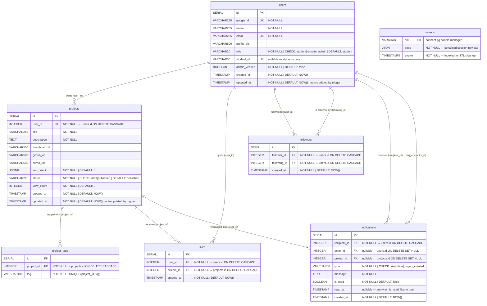

# UOK Connect — Database Schema

## Entity Relationship Diagram

---

## Table Notes

### `users`
| Column | Notes |
|--------|-------|
| `role` | `'student'` can add/edit/delete projects · `'recruiter'` can like/follow · `'admin'` has full moderation access |
| `student_id` | Set after OAuth by the student on the `/complete-profile` page; stored in `sessionStorage` during the OAuth redirect and auto-submitted on return |
| `admin_verified` | Set to `TRUE` when an admin account is created via the secret-key flow |

### `projects`
| Column | Notes |
|--------|-------|
| `status` | `'published'` is the default; `'draft'` hides the project from public browse |
| `tech_stack` | JSONB array of strings, e.g. `["React", "Node.js", "PostgreSQL"]` |
| `view_count` | Incremented server-side on each `GET /api/projects/:id` call |

### `project_tags`
Separate table (not inlined in `projects`) to allow efficient tag-based filtering queries.  
`UNIQUE(project_id, tag)` prevents duplicate tags on the same project.

### `likes`
`UNIQUE(user_id, project_id)` enforces one like per user per project at the DB level.  
The API toggles (like → unlike) using this constraint.

### `followers`
`UNIQUE(follower_id, following_id)` prevents duplicate follows.  
`CHECK(follower_id <> following_id)` prevents self-follow at the DB level.

### `notifications`
Created **only** through the event system (`EventEmitter`), never directly from controllers.  
`actor_id` is nullable to support future system-generated notifications.  
`project_id` is nullable because follow notifications are not project-specific.  
`'comment'` notifications are created when a user comments on another user's project (see `comments` table below and `notificationHandler.js`).

### `session`
Managed entirely by `connect-pg-simple` / `express-session`.  
Used only for the short OAuth flow state (10-minute TTL).  
**Not** used for user authentication — that is handled by a JWT in an HTTP-only cookie.  
Has no FK to `users` by design.

---

## Indexes

| Index | Table | Columns | Purpose |
|-------|-------|---------|---------|
| `idx_projects_status_created` | `projects` | `(status, created_at DESC)` | `GET /projects` filter + sort |
| `idx_projects_user_id` | `projects` | `(user_id)` | `GET /users/:id/projects` |
| `idx_likes_project_id` | `likes` | `(project_id)` | Like-count subquery aggregate |
| `idx_project_tags_project_id` | `project_tags` | `(project_id)` | Tag join in project queries |
| `idx_notifications_recipient_read` | `notifications` | `(recipient_id, is_read)` | Fetch + mark-read queries |
| `idx_followers_following_id` | `followers` | `(following_id)` | Follower-count in user profile |
| `IDX_session_expire` | `session` | `(expire)` | TTL cleanup by connect-pg-simple |

Unique constraints (`UNIQUE(user_id, project_id)` on `likes`, `UNIQUE(follower_id, following_id)` on `followers`, `UNIQUE(project_id, tag)` on `project_tags`) are automatically backed by unique indexes.

---

## Constraint Summary

| Table | Constraint | Type |
|-------|-----------|------|
| `users` | `role IN ('student','recruiter','admin')` | CHECK |
| `projects` | `status IN ('draft','published')` | CHECK |
| `notifications` | `type IN ('like','follow','project_created')` | CHECK |
| `followers` | `follower_id <> following_id` | CHECK |
| `likes` | `(user_id, project_id)` | UNIQUE |
| `followers` | `(follower_id, following_id)` | UNIQUE |
| `project_tags` | `(project_id, tag)` | UNIQUE |
